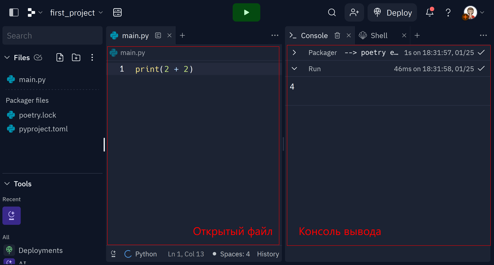

# Типы данных. Целые числа и числа с плавающей точкой

## Знакомство с интерпретатором

Продолжим работу с открытым файлом `main.py` в проекте `replit`. Если у вас еще нет созданного проекта, вернитесь к теме ["Программирование на Python в сервисе replit"](/intro.md#программирование-на-python-в-сервисе-replit).

Посмотрим на результат при запуске кода в проекте. Данная команда выводит на экран сумму двух двоек. Справа в консоли видим ответ "4".



Для того, что начать работу языком программирования Python, необходимо познакомится с интерпретатором языка.

`Интерпретатор` - это программа, которая выполняет построчный анализ исходного кода с дальнейшим выполнением. Интерпретатор запускается каждый раз, когда мы хотим выполнить написанные команды в файле с расширением `.py` (в нашем случае `main.py`). Таким образом, именно интерпретатор Python читает команды и выводит их результат в консоль.

**Совет новичкам**

Часто, интерпретатор Python представляется таким.


_"Ты пишешь код, но ты делаешь это без уважения"._

Однако, на самом деле интерпретатор лучше представить таким.
Очень прямолинейный, простой и недалекий паренёк. Но очень исполнительный.


_"Спасимба. Пожалуймста. Дотвидания"._

**Важно помнить**, что любые команды, которые мы напишем на языке Python, интерпретатор постарается выполнить. Но при возникновении ошибки, помните, что интерпретатор просто выполняет написанные для него инструкции. Если инструкция составлена некорректно, можно ли в этом винить интерпретатор?


Теперь можно приступать к изучению базовых структур, которыми оперирует язык Python.

## Математика в Python

### Арифметические операции

Разберем первую простую команду. Выведем на экран сумму двух чисел.

```Python
print(2 + 2)
```

Чтобы вывести результат вычисления в консоль необходимо ввести `print()` и в скобочках указать операцию для вывода на экран.

Python можно использовать как обычный калькулятор, записав операции сложения, вычитания, умножения и деления. `Операторами` называют знак операции, такой как `+` или `/`. `Операндами` называют значения, которые обрабатываются оператором.

```Python
print(2 + 2)
print(2 - 2)
print(2 * 2)
print(2 / 2)
```

Также доступна операция возведения в степень, которая записывается набором символов `**`.

```Python
print(2 ** 2)
```

В отличии от многих других языков программирования нам не нужно ничего определять предварительно перед совершением операции, что упрощает запись кода.

**Операция деления** в Python имеет несколько вариаций.

* Обычное деление `/`, результатом которого будет дробное число (даже если число делится нацело).
* Деление нацело `//`. В этом случае дробная часть отбрасывается.
* Деление с остатком `%`, при котором берется обычный остаток от деления.

```Python
print(2 / 2)   # Ответ: 1.0
print(2 // 2)  # Ответ: 1
print(2 % 2)   # Остаток от деления. Ответ: 0
print(10 % 3)  # Как при делении столбиком! Ответ: 1
```

### Комментарии

Если нам необходимо записать текст, который интерпретатор Python не будет считывать как код, то в этом нам помогут комментарии. Комментарии начинаются с символа `#` и продолжаются до конца строки. Пример:

```Python
# Это однострочный комментарий
print(2 + 2)
```

Комментарии помогают разработчикам и читателям кода понять назначение определенных частей кода, а также дают возможность временно отключать части кода во время отладки.

### Типы данных

Обратите внимание на результат операции деления. Не смотря на то, что число делится нацело, результат выглядит как десятичная дробь. Это нам говорит о том, что `тип данных` при разных операциях будет отличаться.

Чтобы узнать тип данных, допишем `type()` после `print()`.

```Python
print(type(2 * 2))  # <class 'int'>
print(type(2 / 2))  # <class 'float>
```

Программы в Python выполняют обработку информации. Компьютер воспринимает любую информацию как поток байтов, однако для удобства восприятия данных человеком, программисты решили выделять `абстракции`.

Такими абстракциями выступают `типы данных` – представление полученной информации с заданными свойствами.
Результатом той или иной операции является данные, представленные конкретным типом. Тип данных имеет символьное обозначение и для каждого элемента данных в Python определен собственный тип. Например, при вводе числа 1, 2 или -10, интерпретатор знает, что относятся к типу данных целых чисел `int`. Существуют и другие встроенные типы данных, которые перечислены ниже.

Название    | Обозначение
:--         | :--
int         | целые числа
float       | вещественные числа
bool        | логический тип данных
str         | строки
list        | списки
tuple       | кортежи
dict        | словари
set         | множества
и др.       |

Таким образом, к типам данных в Python относятся целые числа `int` и вещественные числа `float`.

* Целые числа включают в себя все положительные, отрицательные числа и нуль.
* Вещественные числа включают в себя положительные и отрицательные числа. Float состоит из экспоненты и мантиссы. [Подробнее по ссылке](https://docs-python.ru/tutorial/operatsii-chislami-python/problemy-chisel-plavajuschej-zapjatoj/).

Float имеет разные формы записи.

```Python
200      # int
-100     # int
0        # int
50.0     # float
13.5012  # float
1e+7     # float
```

При попытке выполнить записанные значения выше, **интерпретатор ничего не выведет в консоль, так как отсутствует print()**. Это не является ошибкой и в практическом применении `print()` нужен не так часто, но сейчас без данной записи в консоль не будет выведен результат.  

### Встроенные функции в Python

Узнать тип данных, вывести в консоль, узнать длину объекта и многое другое можно с помощью `встроенных функций`.

Если `типы данных` – это представление информации, то `функции` – это инструменты для обработки этой информации. В Python существует набор встроенных функций, которые позволяют делать основные операции с типами данных.

Для того, чтобы «вызвать» функцию, нужно написать определенное ей имя и в скобках после передать аргументы – данные для обработки. Например, для вызова функции  `print` нужно ввести ее имя _("вызвать функцию")_ и в скобках после имени указать `аргументы` (другое название `параметры`), котора функция должна обработать. В случае с `print()` функция выведет аргументы в скобках в консоль на экране, `type()` выведет информацию о типе данных аргумента.

```Python
print(150.01)
print(type(150.01))
```

**Заметьте, что функция может быть внутри функции!** Такая запись может встречаться часто в Python.

Ниже приведено три примера известных встроенных функций.

Название            | Обозначение
:--                 | :--
`print(x, y, z)`    | вывести в консоль.<br>_Интерпретатор позволяет выводить значения без функции print, однако для вывода результата в консоль через файлы с расширением .py необходимо использовать print_
`type(x)`           | вернуть тип данных
`round(x, n)`       | округлить float до целой части или до указанного значения после запятой
`input(chars)`      | ввести значения с консоли

### Приведение к типу данных

Существуют операции, которые позволяют приводить одни типы данных к другим.
Например, целое число `int` можно превратить в `float` _(то есть 1 --> 1.0)_. И наоборот. Например, при подстановке в тип данных bool единицы получим True. При подстановке нуля – False. Об этом подробнее в следующих разделах.

```Python
int(10.105)  # 10
float(105)   # 105.0
bool(1)      # True
```

**Промежуточный итог и справка по вопросам**

Теперь вы знаете что такое интерпретатор, с какими числами можно работать в Python и как эти числа подразделяются на типы данных. Следующие параграфы посвящены каверзным вопросам по теме "Целые числа и числа с плавающей точкой" и объяснению правильных ответов. Данный формат предложен для лучшего закрепления пройденного материала на начале обучения. Поэтому постарайтесь ответить на предложенные вопросы **сначала самостоятельно, потом перейти к объяснениям**. В объяснениях будет рассмотрен подробнее новый материал, поэтому обязательно изучите их.

## Вопросы по теме

### Вопрос 1

Каким будет результат выполнения кода ниже?

```Python
print (9//2)
# 4.5
# 4.0  
# 4
# Error
```

### Вопрос 2

Каким будет результат выполнения кода ниже?

```Python
print(30.0//3)
# 10.0
# 10 
# 100   
# Error
```

### Вопрос 3

Каким будет результат выполнения кода ниже?

```Python
print(round(12.5) - round(11.5))
# 0
# 1
# 2
# Error
```

### Вопрос 4

Каким будет результат выполнения кода ниже?

```Python
print(0.1 + 0.2 == 0.3)
# True
# False
# Зависит от интерпретатора языка
# Error
```

### Вопрос 5

Каким будет результат выполнения кода ниже?

```Python
print(~~~~~~5)
# +5
# -11
# +11
# -5
```

### Вопрос 6

Каким будет результат выполнения кода ниже?

```Python
print(int(21) + float(21) * 0)
# 21
# 0
# 21.0
# 0.0
```

### Вопрос 7

Каким будет результат выполнения кода ниже?

```Python
print(
    (2 * 4) % 3,
    3 * 2 % 3,
    5 * (1 % 3),
)
# 0 0 5
# 2 1 5
# 2 0 5
# Error
```

## Ответы на вопросы и пояснения

### Ответ на вопрос 1

Каким будет результат выполнения кода ниже?

```Python
print (9//2)
# 4.5
# 4.0  
# 4    <- правильно
# Error
```

**Обратите внимание! Пробелы**

Операция целочисленного деления не вызывает вопросов, но после `print` стоить пробел. Представим, что операция записана следующим образом:

```Python
print((2**4124)/224+532*23/(214**2))
```

Прочитать это затруднительно, поэтому следует придерживаться следующих правил:

```Python
# 1. используем пробелы между операндами. 
print(500 ** 2 + 100, 100 // 25)  

# 2. можно разносить параметры функции по строкам
print(
    500 ** 2 + 100, 
    100 // 25
    )
    
# 3. Между функцией и скобочкой пробел не желательно использовать.
print(type(len([1, 2, 3])))
```

Таким образом, записывать пробел между функцией и скобочкой можно, но так обычно не пишут. Тем не менее ошибку это не вызовет!

### Ответ на вопрос 2

Каким будет результат выполнения кода ниже?

```Python
print(30.0//3)
# 10.0  <- правильно
# 10 
# 100   
# Error
```

**Обратите внимание! Операции с float**

Если один из операндов имеет тип данных `float`, то и ответ будет `float`. Но, при этом деление нацело работает.

```Python
print(27.3 / 5)    # 5.46
print(27.3 // 5)   # 5.0
```

### Ответ на вопрос 3

Каким будет результат выполнения кода ниже?

```Python
print(round(12.5) - round(11.5))
# 0  <- правильно
# 1
# 2
# Error
```

**Обратите внимание! банковский метод округления**

При **арифметическом округлении** в большую сторону округляются 5,6,7,8,9, в меньшую 1,2,3,4. Однако, в реальности мы работаем не со случайным набором чисел, а с конечным. Таким образом, выходит, что больше чисел округляется вверх. **Случайная ошибка** такого подхода при случайной выборке **довольно высока**.

Решением является **банковский метод** округления числа к ближайшему четному числу. Данный метод реализован в Python 3.

### Ответ на вопрос 4

Каким будет результат выполнения кода ниже?

```Python
print(0.1 + 0.2 == 0.3)
# True
# False  <- правильно
# Зависит от интерпретатора языка
# Error
```

**Обратите внимание! потеря точности**

Так как ни 0.1, ни 0.2, ни 0.3 нельзя точно представить в двоичном виде, накапливается большое количество ошибок в промежутке от 0.1 до 0.2. В итоге между (0.1 + 0.2) и 0.3 существует разница в 5.5511e-17.
Более того, для хранения обычного числа int можно выделить 4 байта. Но как компьютер должен хранить число, у которого есть целая часть и дробная? Ведь бывают иррациональные дроби (1.1(6)) и, если человек может представить такое число, то как его поместить в памяти компьютера? Поэтому, было придуман следующий шаг.


Дробное число состоит из экспоненты и мантиссы. Экспонента (целая часть) занимает 4 байта, мантисса (дробная часть) тоже занимает 4 байта. Целую часть записывается как обычное целое число, а для дробной части выделяется диапазон из 4 байт, которого достаточно, чтобы передать точность до 8 знака. Но то что после, хранить в памяти не обязательно. По этой причине при проведении математических операций с типом данных float, падает точность. 

### Ответ на вопрос 5

Каким будет результат выполнения кода ниже?

```Python
print(~~~~~~5)
# +5  <- правильно
# -11
# +11
# -5
```

**Обратите внимание! бинарные операторы**

В Python работают бинарные операторы такие как, и `&`, или `|`, исключающее или `^` и не `~`. Их можно встретить при решении различного рода задач, которые требуют скорости обработки значений. Оператор `~` - это операция "инвертировать", в которой все биты входных данных обращены. Формула, по которой вычисляется результат операции `~`, приведена ниже.

```Python
# ~n == -(n + 1)
# тогда для ~5
~5 == -(5 + 2)
```

Рассмотрим использование `~` на другом числе подробнее. В битах 6 можно представить как `00000110`. Тогда, если все биты "перевернуть" то новое значение будет `11111010`, то есть в десятичной системе это 2^8 - 6 = 250. Так можно записывать отрицательные числа используя те же комбинации бит.

```Python
~6 == -(6 + 1) == -7
~~2 == -(-(2+1) + 1) == 2
```

### Ответ на вопрос 6

Каким будет результат выполнения кода ниже?

```Python
print(int(21) + float(21) * 0)
# 21
# 0
# 21.0  <- правильно
# 0.0
```

**Обратите внимание! Приведение к типу данных**

При сложении `int` и `float` мы получаем `float`. Поэтому `int(21) + float(21) = 42.0`, но! У нас есть ещё `float(21) x 0`, который выполняется раньше.

В итоге мы имеем: `int(21) + float(21) x 0 <==> int(21) + 0.0 <==> 21.0`

### Ответ на вопрос 7

Каким будет результат выполнения кода ниже?

```Python
print(
    (2 * 4) % 3,
    3 * 2 % 3,
    5 * (1 % 3),
)
# 0 0 5
# 2 1 5
# 2 0 5  <- правильно
# Error
```

**Обратите внимание! Последовательность операций**

Давайте пройдемся по каждой переменной по отдельности.

`fnum = (2 x 4) % 3` — здесь сначала выполняется умножение `(2 x 4 = 8)`, а затем у полученного числа берётся остаток от деления на три `(8 % 3 = 2)`. По итогу `fnum = 2`.

`snum = 3 x 2 % 3` — здесь также сначала `3 x 2 = 6`, а уже затем `6 % 3 = 0`. Связано это с тем, что операции умножения и получения остатка от деления имеют одинаковый приоритет. `snum = 0`.

`tnum = 5 x (1 % 2)` — здесь наоборот, сначала `1 % 2 = 1`, а затем `5 x 1 = 5`. В итоге `tnum = 5`.
