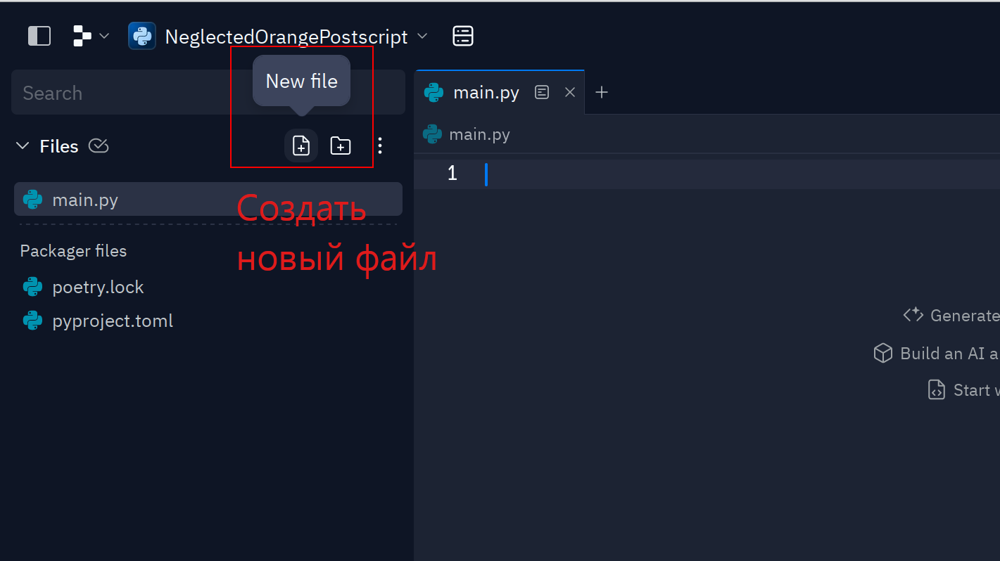
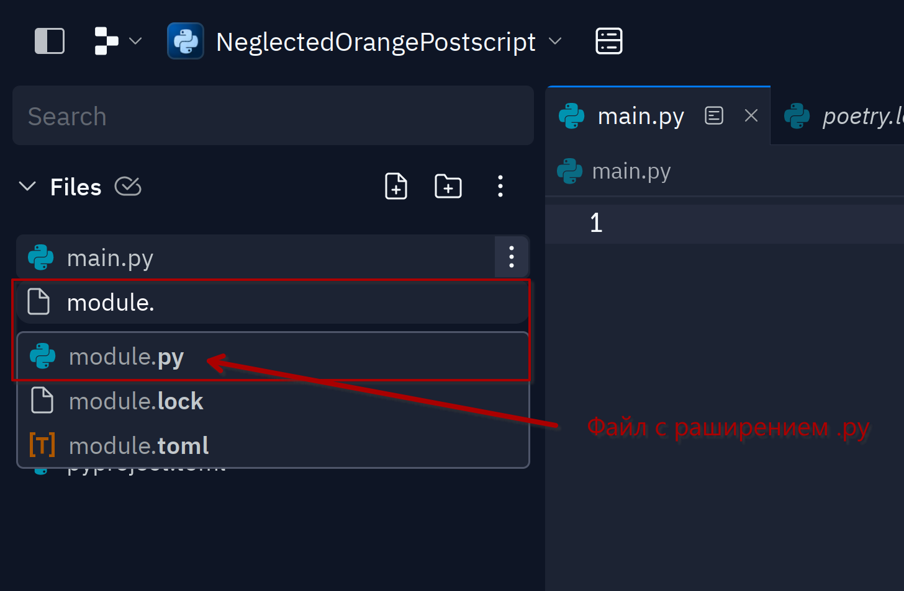
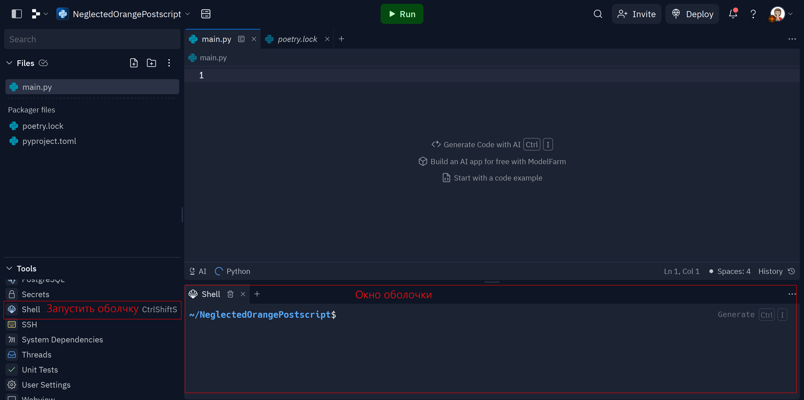

# Импорт. Работа с файлами

## Зачем программу размещать в разных файлах?

Разнообразные объекты в Python, такие как типы данных и функции, обычно не находятся в вакууме. Они фиксируются в модулях и пакетах, к которым разработчики также имеют доступ.

Когда кода становится слишком много, чтобы хранить его в одном файле, то гораздо удобнее разделить код на несколько файлов и импортировать из них функции и прочие объекты, которые в них находятся.

## Дополнительная информация о работе с replit

В данном разделе нам понадобятся следующие инструменты `replit`:

* создание файлов и папок,
* оболочка,
* пакеты.

Для того чтобы создать новый пустой файл или папку, необходимо нажать соответствующую иконку в проводнике слева.

Для того чтобы интерпретатор смог распознать команды, файл должен иметь расширение _.py_. **Расширение файла `.py`** указывает на то, что этот файл является скриптом на языке программирования Python. Такие файлы содержат исходный код программы, который может быть выполнен интерпретатором Python.

Расширение файла указывает на тип данных, которые содержатся в этом файле, и обычно используется операционной системой для определения программы, которая может открыть или обработать этот файл. Например, файлы с расширением _.jpg_ содержат растровые изображения, и для их открытия требуется программа просмотра изображений.

Для работы с внешними пакетами нам понадобится **оболочка**, то есть программа, которая позволяет пользователю **вводить команды и выполнять их на компьютере**. Ее можно запустить в новом окне, выбрав соответствующий инструмент.

.
