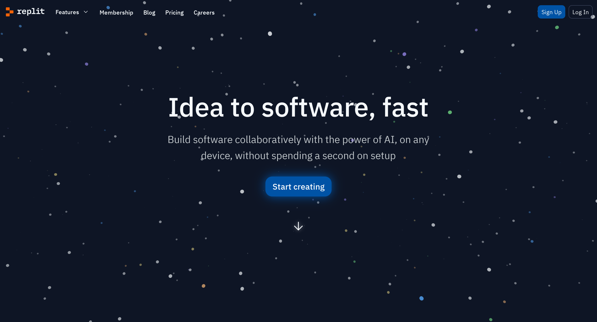
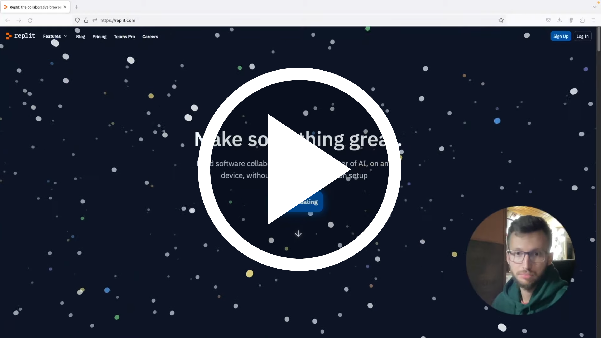

# Что такое Python? Начало работы

## О языке Python


Знакомьтесь! Это голосовой помощник Алиса. Данный сервис обрабатывает голосовые команды и генерирует связанные тексты различной сложности.

Получить грамматически правильный текст Алисе удается с помощью зависимостей параметров, заложенных внутри языковой модели YaLM. Открытый исходный код проекта можно найти на [портале GitHub](https://github.com/yandex/YaLM-100B).


Вы могли заметить, что данная модель преимущественно написана на Python. Этому есть несколько причин:

1. Python – один из наиболее подходящий языков для обработки больших объемов данных.
2. Кроме того, Python является языком, который широко используется в научных исследованиях и анализе данных, что делает его идеальным выбором для создания модели, подобной YaLM.

## Преимущества Python

Во-первых, Python имеет простой и понятный синтаксис. Например, ниже представлен код для вывода фразы "Hello, World!" на экран.

Для языка Java:

```Java
public class HelloWorld {
    public static void main(String[] args) {
        System.out.println("Hello, world!");
```

Для языка Python:

```Python
print("Hello, World!")
```

А также:

* С помощью Python удобно писать скрипты для автоматизации рутинных задач.
* Для Python написано множество библиотек и модулей для решения прикладных задач.
* Python активно развивающийся язык с большим сообществом.
* Можно быстро разработать проект Proof of Concept.
* Интерпретатор Python доступен на любых платформах: MacOS, Windows, Linux.

## История названия языка


Да, как ни странно, но язык программирования Python назван не в честь змеи. Создатель языка, сотрудник голландского института математики и информатики, [Гвидо ван Россум](https://ru.wikipedia.org/wiki/%D0%A0%D0%BE%D1%81%D1%81%D1%83%D0%BC,_%D0%93%D0%B2%D0%B8%D0%B4%D0%BE_%D0%B2%D0%B0%D0%BD) назвал язык в честь популярного в 70-х телешоу [«Летающий цирк Монти Пайтона»](https://ru.wikipedia.org/wiki/%D0%9B%D0%B5%D1%82%D0%B0%D1%8E%D1%89%D0%B8%D0%B9_%D1%86%D0%B8%D1%80%D0%BA_%D0%9C%D0%BE%D0%BD%D1%82%D0%B8_%D0%9F%D0%B0%D0%B9%D1%82%D0%BE%D0%BD%D0%B0).

В отрытый доступ язык был выложен в 1991 году. Изначально это был [скриптовый язык](https://ru.wikipedia.org/wiki/%D0%A1%D1%86%D0%B5%D0%BD%D0%B0%D1%80%D0%BD%D1%8B%D0%B9_%D1%8F%D0%B7%D1%8B%D0%BA), ориентированный на обучение программированию. Впоследствии язык приобрел большую популярность. Сегодня основной распространяемой версией языка Python является третья, или Python3 (существует также [Python2.7](https://www.8host.com/blog/python-2-vs-python-3-kratkij-obzor-i-prakticheskie-soobrazheniya/)), которая является [интерпретируемым языком](https://tproger.ru/translations/programming-concepts-compilation-vs-interpretation).

## Правила работы с материалом

Курс представлен в формате веб-страниц с текстовым материалом, в которых приведены примеры кода и дополнительный материал для рассмотрения. В некоторых случаях текстовый материал дублируется видеоматериалом. Вся информации в курсе поделена на разделы по темам, между которыми можно переключаться в начале и в конце раздела.

В начале раздела представлена выкладка по теме, после которой следуют вопросы по теме, как проблемное обсуждение вопросов, на которые автор предлагает обратить внимание. Некоторые разделы представлены в виде формате решения задач и обсуждением решения и дополнительного материала.

**Условные обозначения**

* `Python` - обозначение термина или синтаксической конструкции, например `print()`.
* **нельзя складывать** - места в параграфе, на которые стоит обратить внимание.
* [Ссылка](#правила-работы-с-материалом) на дополнительный материал для самостоятельного изучения. В данном случае ссылка ведет к текущему параграфу.
* Блок кода - одно из самых часто встречаемых обозначений. Рекомендуется копировать код из блоков по теме и запускать код в среде разработки.

```Python
print("Hello, World!")
``` 

## Программирование на Python в сервисе replit



Все примеры и проекты данного курса можно выполнить с использованием сервиса для совместного программирования `replit`, для работы в котором необходимо использовать браузер (например, Chrome, Safari или Mozila). Все примеры данного курса, также, можно выполнять в среде разработки или редакторе кода, однако онлайн-сервис replit выбран для упрощения работы с языком Python на начальном этапе. Следовательно, установка дополнительных программ на компьютер, кроме браузера, не требуется.

### Задание: начало работы с replit

1. Зарегистрируйтесь в replit.com. Для регистрации перейдите [по ссылке](https://replit.com/).
2. Создайте новый проект с кодом Python.
3. Запустите первый скрипт в файле `main.py`

Код для вставки в файл.

```Python
print(2 + 2)
```

**Справка по заданию**

1. Для регистрации в сервисе можно использовать использовать обычную почту, если выбрать пункт `Continue with email`. Также вы можете выбрать регистрацию через аккаунт Google или Github, если они у вас имеются. **Не забудьте почту и пароль для входа в replit. Они нам понадобятся!**

2. Проект, в котором можно совместно писать код и запускать программу, называется `repl`. Чтобы создать такой проект, после регистрации необходимо нажать кнопку `Create Repl` в правом верхнем углу.

3. В окне создания репла вам необходимо выбрать язык проекта - Python, а также дать название проекту.

4. После создания репла откроются сам репл, который содержит открытый файл, в котором можно писать команды на языке Python, и консоль, в которой можно будет увидеть результат запуска программы. Введите код из задания и запустите проект, нажав на кнопку `Run`

### Видео: Начало работы с replit

Подробнее о работе в сервисом `replit` вы можете посмотреть в видеоуроке.

[](https://www.youtube.com/watch?v=tHOyDVBxBvU&lc=UgxMvDJuce3-XnAv6Lx4AaABAg)
